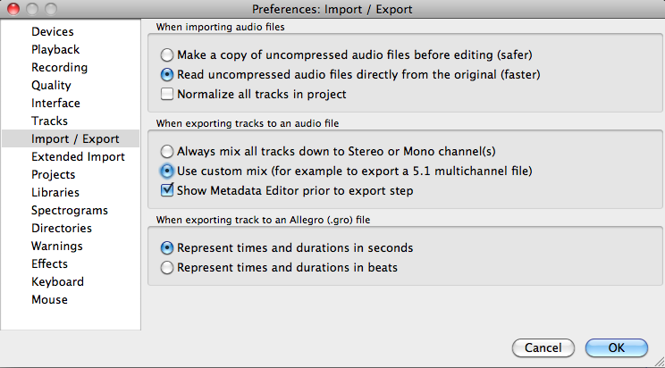
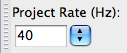

# Editing animation with Audacity

## Opening a wave animation

Animation files are stored in : ```MisbehaviorTK/anims/``` .

Choose the one you want to edit and open it with *Audacity*.

## Recording an edited animation

First of all enable *custom mix* which you can find inside the *Preferences* menu : ```Audacity/Preferences...``` . Inside the popup menu choose ```Import / Export``` and select *Use custom mix* .



Before exporting your file : ```File/Export``` make sure that the *Project rate is set at **40** in the bottom left menu : 


